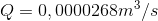
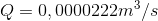
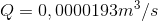
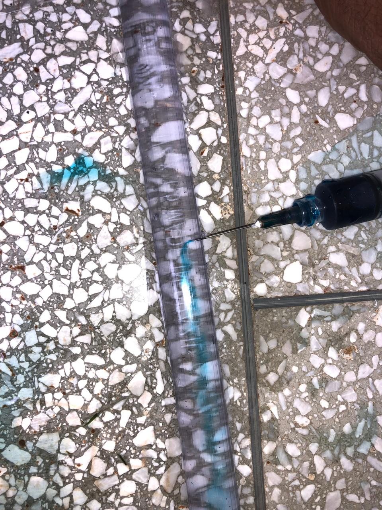
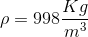
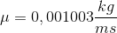
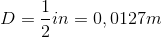
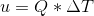
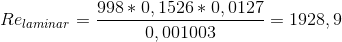
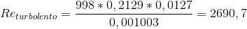

# Relatório do Grupo 13: #

### Nota da Etapa: 2,5 ###

### 1.1.	Integrantes do grupo: ###

  - Pedro Paulo de Souza Pereira - 12/0132737
  - Vinícius Tadeu Ciurlini - 16/0148103
  - Leonardo Julio Chagas Souza - 13/0143413
  
 ### 1.2.	Tema Escolhido ### 

-	Turbulência em Fluidos

 ### 1.3.	Objetivo do experimento ### 
 
- O experimento tem como objetivo verificar experimental o número de Reynolds de um flúido, variando a velocidade do fluído. 

 ### 1.4.	Escopo do experimento ### 

-	Será utilizado o adimensionamento de Navier-Stroke, secção 4.2.1 das notas de aula, para determinar o número de Reynolds do fluído variando a velocidade do fluído e com um corante para verificar o regime do fluído.

### 2.	Planejamento e Preparação: ###

### Nota da Etapa: 2,5 ###

### 2.1.	Teoria do experimento ###

Popularizado em 1883 por Osborne Reynolds, que demonstrou a existência de três tipos de escoamento, o Laminar, o transitório, e o regime turbulento.
No escoamento laminar o escoamento em camadas planas onde as moléculas do fluido estão aderentes umas nas outras, fluindo de maneira organizada onde: escoamento tranquilo e em camadas paralelas.
Já regime turbulento o escoamento é visto com oscilações das molécula em torno de seu próprio eixo, o que causa uma mistura intensa do liquido em si próprio e as camadas paralelas não irão existir mais.	
Reynolds nomeou seu número absoluto como sendo o número de Reynolds, que é, hoje, a base para estudo do comportamento de sistemas reais no escoamento.
O número de Reynolds é calculado a partir da equação:

    
O resultado dessa equação apresenta a característica do regime do fluído.
   - Re < 2000 - escoamento laminar
   - 2000 < Re < 2400 - Escoamento Transitório
   - Re > 2400 - Escoamento turbulento

### 2.2.	Procedimento experimento ###

  ### 2.2.1.	Matériais ###
  - Reservatório de água;
  - Tubo transparente;
  - Torneira;
  - Conectores;
  - Seringa com agulha;
  - Corante azul;
  - Água;
  
  ### 2.2.2.	Montagem ###
  
  A montagem do experimento consiste nos passos:
  1. Montagem do sistema reservatório-tubo-torneira;
  O sistema será montando conectando o reservatório de água a um tubo transpente de 1 metro e o tubo conectado à torneira, utilizando os conectadores.
  2. Preparação da água com coloração azul;
  Uma solução de água utilizando o corante azul será preparada e utilizando uma seringa será colocada aproximadamente 0,5 metro no tubo transparante.
  3. Inserção de lâmina de água no sistema reservátorio-tubo-torneira.
  Com intuíto de verificar o regime do sistema, a água azulada será inserida na seringa e depois inserida no tubo transparente para verificar como está o regime em termo da vazão.
  O tempo estimado para montagem do experimento é de 3 semanas, incluindo processo de compra de matérial e montagem do experimento com todas as correções executadas. O experimento será executado no Laboratório de Fluídos localizado na Universidade de Brasília Campus Gama.
  
  ### 2.3.	Cronograma ### 
  
  - Compra de matérial até 5/10/2018
  Responsável: Todos os membros do grupo.
  - Montagem do sistema reservatório-tubo-torneira até 12/10/2018
  Responsável: Leonardo Julio Chagas Souza;
  - Teste do sistema reservatório-tubo-torneira até 19/10/2018 
  Responsável: Leonardo Julio Chagas Souza;
  - Preparação da água com coloração azul
  Responsável: Pedro Paulo de Souza Pereira;
  - Preparação da lâmina de água no sistema reservátorio-tubo-torneira até 24/10/2018
  Responsável: Pedro Paulo de Souza Pereira e Vinícius Tadeu Ciurlini;
  - Teste da lâmina de água no sistema reservátorio-tubo-torneira até 28/10/2018
  Responsável: Pedro Paulo de Souza Pereira e Vinícius Tadeu Ciurlini;
  - Resultados do experimento até 01/11/2018
  Responsável: Todos os membros do grupo.
  
   ### 2.4.	Dados e Resultados ###
   
   Dado a formulação do núemro de Reynolds o único parâmetro a ser medido no experimento é a velocidade do fluído a partir da vazão, pois os outros dados já foram são conhecidos por medições experimental ou propriedades e característica do fluído ou matérial utilizado no experimento, pela lâmina de água de coloração azul será possível verificar visualmente o regime do fluído, e os resultados esperados é que para número de Reynolds calculado em função da vazão siga os seguinte comportamento:
    
   - Re < 2000 - escoamento laminar
   - 2000 < Re < 2400 - Escoamento Transitório
   - Re > 2400 - Escoamento turbulento
  

### 3.	Execução: ###

  ### 3.1 Divisão de tarefas ###
  
   - Compra de matérial
  Responsável: Leonardo Julio Chagas Souza e Vinícius Tadeu Ciurlini
  - Montagem do sistema reservatório-tubo-torneira
  Responsável: Vinícis Tadeu Ciurlini;
  - Teste do sistema reservatório-tubo-torneira 
  Responsável: Leonardo Julio Chagas Souza e Vinícius Ciurlini;
  - Preparação da água com coloração azul
  Responsável: Leonardo Julio Chagas Souza;
  - Preparação da lâmina de água no sistema reservátorio-tubo-torneira
  Responsável: Leonardo Julio Chagas Souza e Vinícius Tadeu Ciurlini;
  - Teste da lâmina de água no sistema reservátorio-tubo-torneira
  Responsável: Leonardo Julio Chagas Souza e Vinícius Tadeu Ciurlini;
  - Resultados do experimentos
  Responsável: Todos os membros do grupo.
  
  O membro Pedro Paulo de Souza Pereira não participou da realização do experimento, todo o experimento foi realizado entre os dias 04 de novembro até o dia 08 de novembro de 2018. As mudanças de datas entre o cronograma foi realizada devido a conflitos de agendas.

   ### 3.2 Procedimentos ###
   
   A montagem do experimento seguiu os seguintes passos:
   - Conexão do reservatório de água com a mangueira transparente e o regulador de vazão;
   - Coloração da água para azul utilizando o corante artifícial;
   - Inserção da seringa na mangueira transparente.
   
   
   
  Sistema separado 
  
  
  
  Sistema integrado
    
  ### 3.3 Dados medidos
  
Na realização do experimento três regimes foram observados, laminar, transiente e turbolento, com isso para cada regime foi deixado o sistema aberto por 60 segundos e medido o volume de água vazado duranto o tempo. Utilizando a formula:
    

sendo o valor da área:

Com esses valores foi possível determinar três vazões
- Vazão 1

- Vazão 2

- Vazão 3

Sendo que cada vazão gerou respectivamente os seguintes tipo de regime:
- regime laminar

- regime transiente

- regime turbolento

### 4.	Análise e conclusão: ###

   ### 4.1 Análise ###
  
  Sabendo os seguintes dados, já tabelados:
  - 
  - 
  - 
  
  e calculando a velocidade do fluido pela relação , teremos as seguintes velocidade para cada tipo de fluído
  
  - 
  - 
  - 
  
Com os dados calculados a partir do experimento e já tabelados é possível calcular no número de Reynolds para cada um dos regimes utilizando a formula , com isso temos:
  
  - 
  - 
  - 
  
   ### 4.2 Comparação ###
   
   A teoria determinada por Reynolds define:
   
   - Re < 2000 - escoamento laminar
   - 2000 < Re < 2400 - Escoamento Transitório
   - Re > 2400 - Escoamento turbulento
   
Assim o experimento conseguiu reproduzir o experimento de Reynolds de forma direta, pois os valores obtidos condizem totalmente com a literatura.
   
   ### 4.3 Conclusão ###
   
O experimento consegue de forma simples e clara mostrar os conceitos relacionados com dinâmicas de fluídos no que tange o compartamento de um fluído em movimento, sendo possível observar de forma bem clara a relação da variação de velocidade do fluído com o seu respectivo comportamento, sendo assim indicável a realização para experimentação didática, porém dado a formula de obtenção de dados para o experimento, mesmo com resultados de acordo com a biografia, é necessário utilizar forma mais cara e precisa de medição assim como regulação de vazão e velocidade para uma realização mais acurada do experimento, principalmente na exploração das zonas de limites do experimento. 
